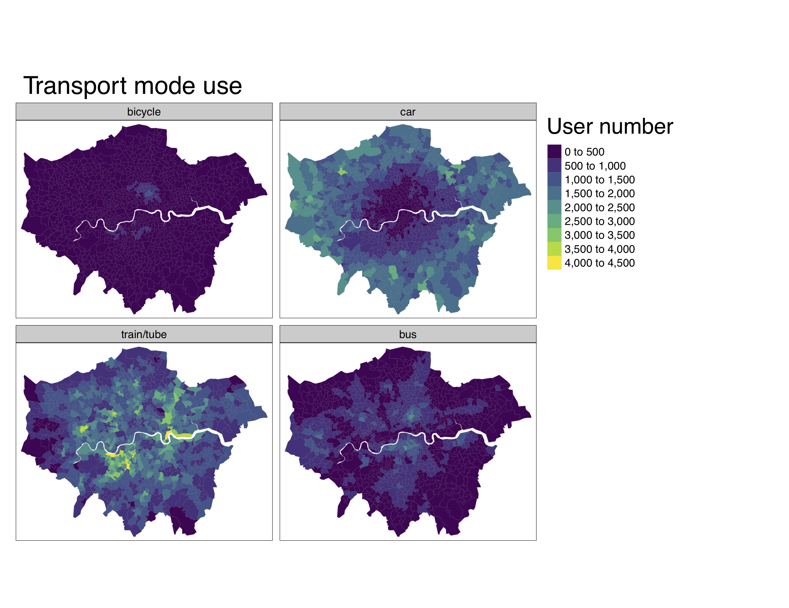
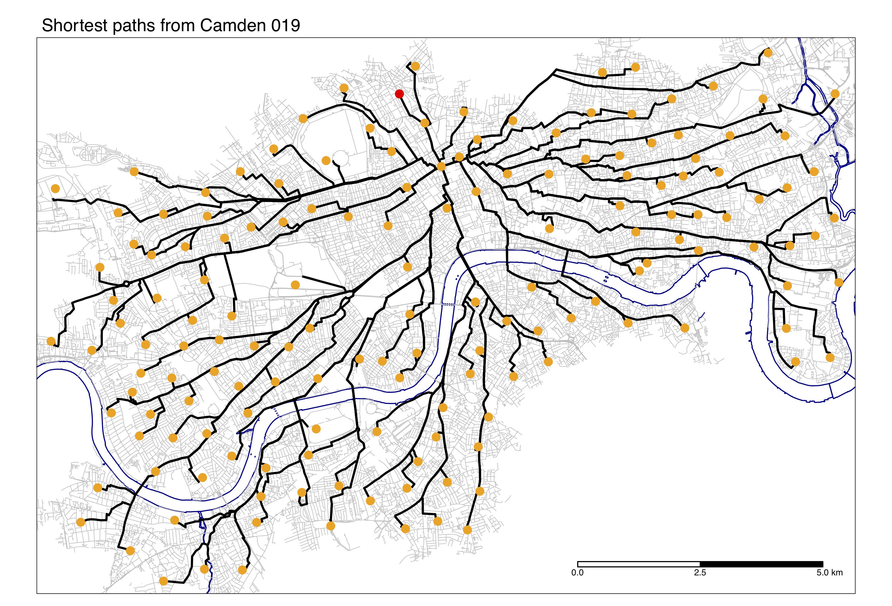

---
<<<<<<< HEAD
title: "Repository description"
author: "Ivann Schlosser"
dev: "png"
fig_caption: true
output: github_document
---

```{r setup, include=FALSE}
knitr::opts_chunk$set(echo = FALSE)

```
=======
title: "description_git"
author: "Ivann Schlosser"
dev: "png"
fig_caption: true
output: html_document
---


>>>>>>> git_ssh

# Folder structure

The folder `scripts` contains all the necessary code to reproduce the results of the work on cycling networks for London.

<<<<<<< HEAD
# Code 


```{r eval=FALSE,echo=FALSE,include=TRUE}

source("scripts/functions.R")

```

=======

# Code 

In order to set up and run this code blablabla
>>>>>>> git_ssh


# Images

<<<<<<< HEAD
The images illustrate the number of users by transport mode at MSOA level. 





=======

The images illustrate blablabla
>>>>>>> git_ssh
